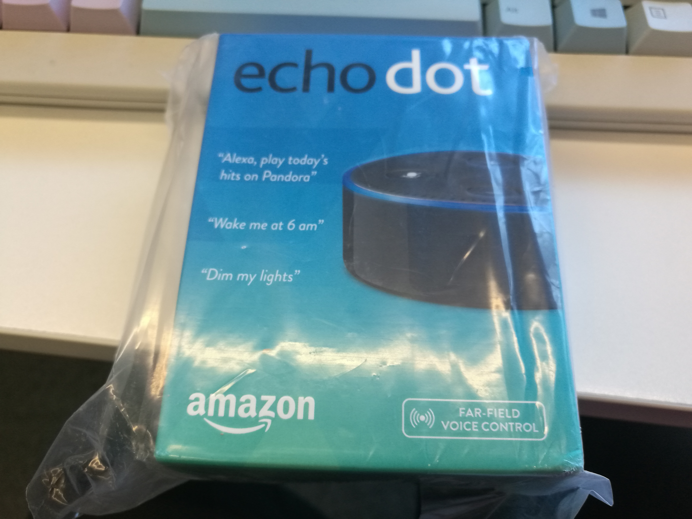
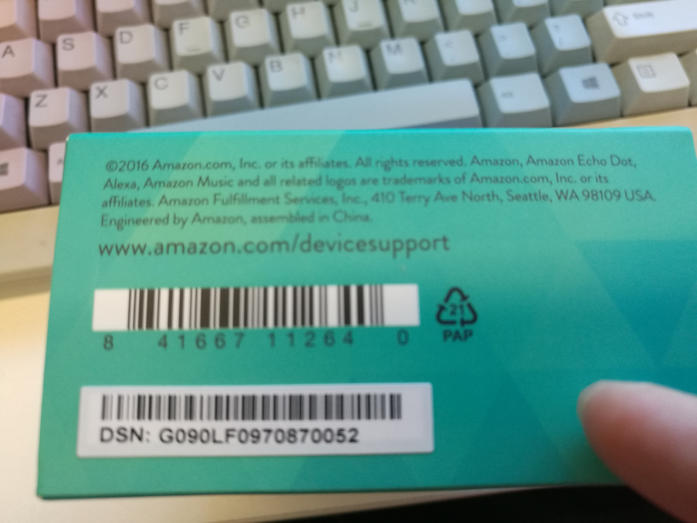
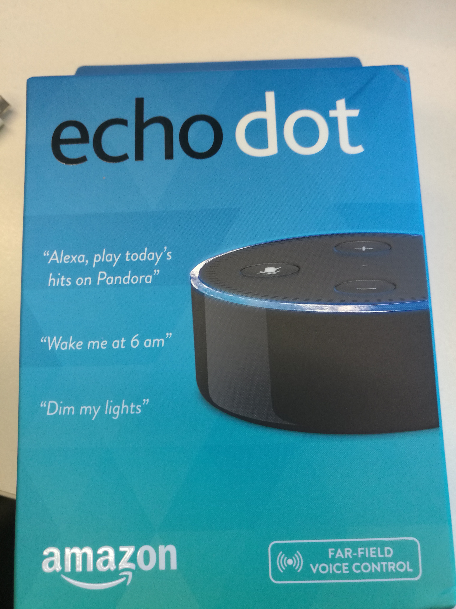
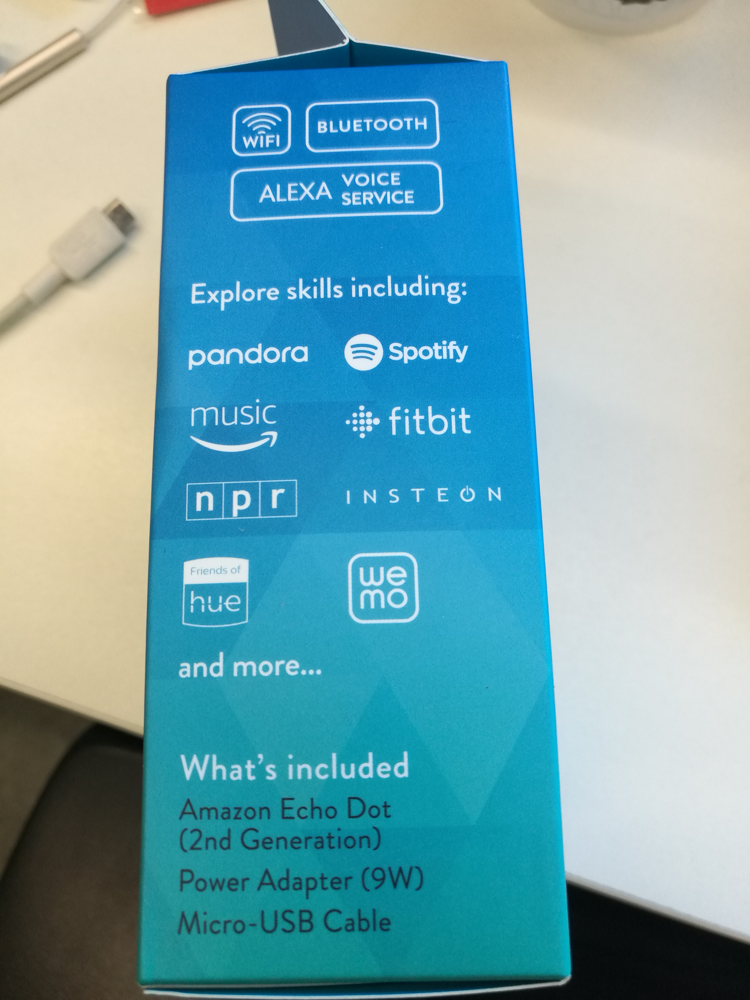
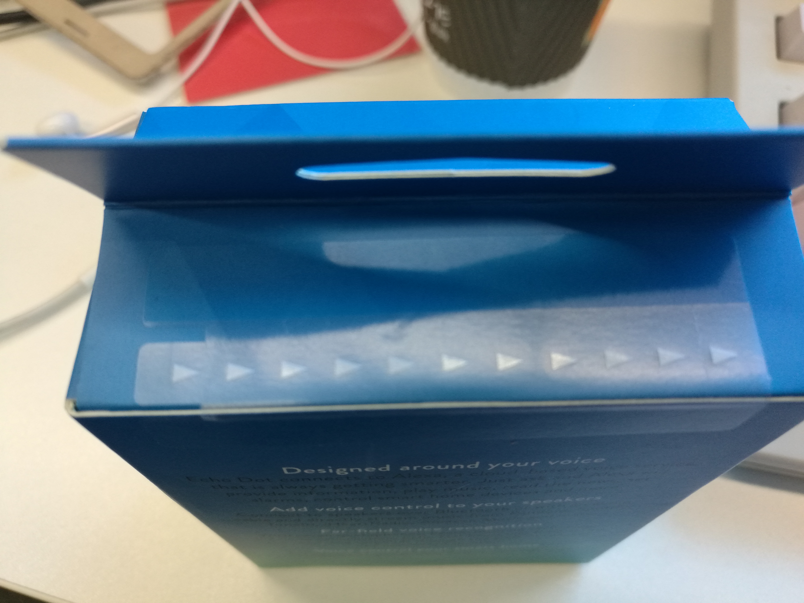
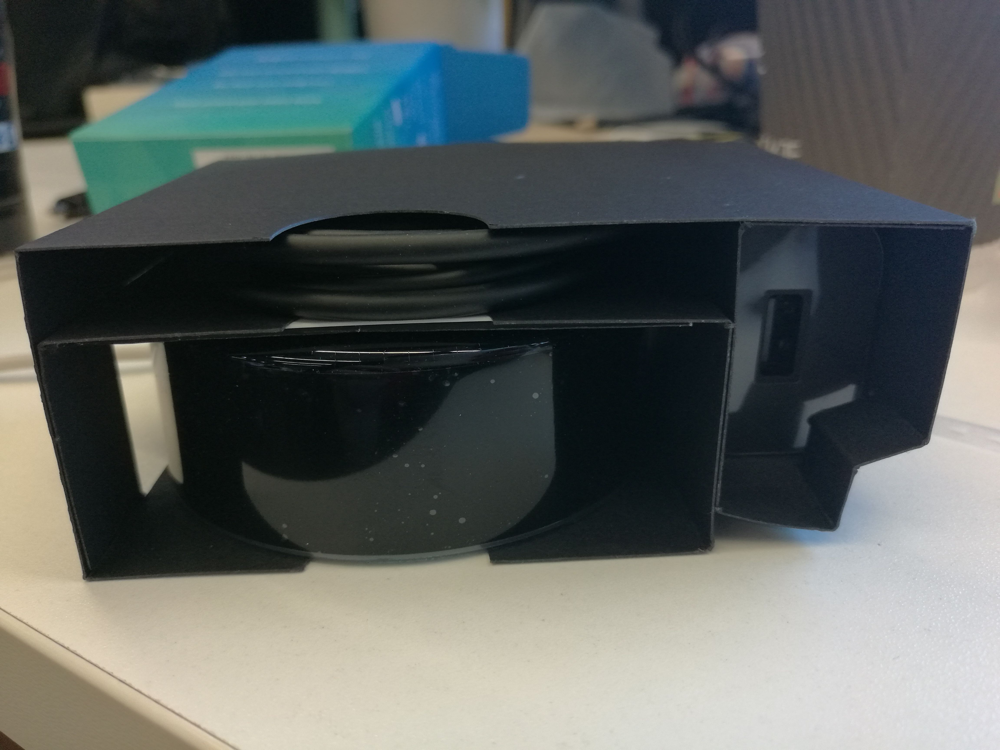
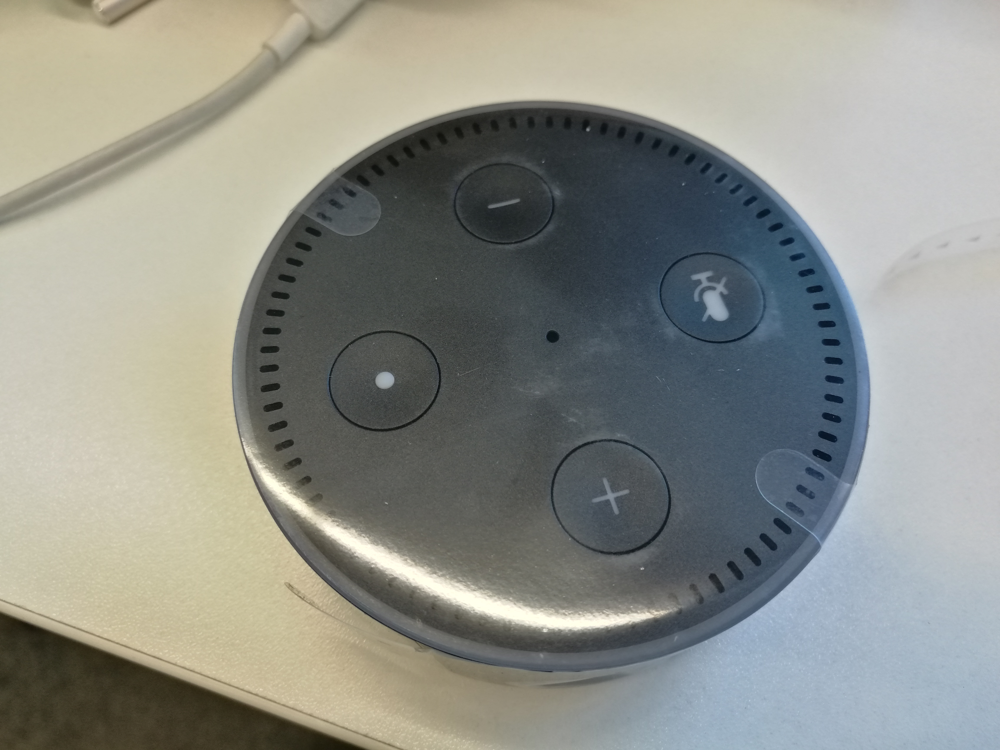
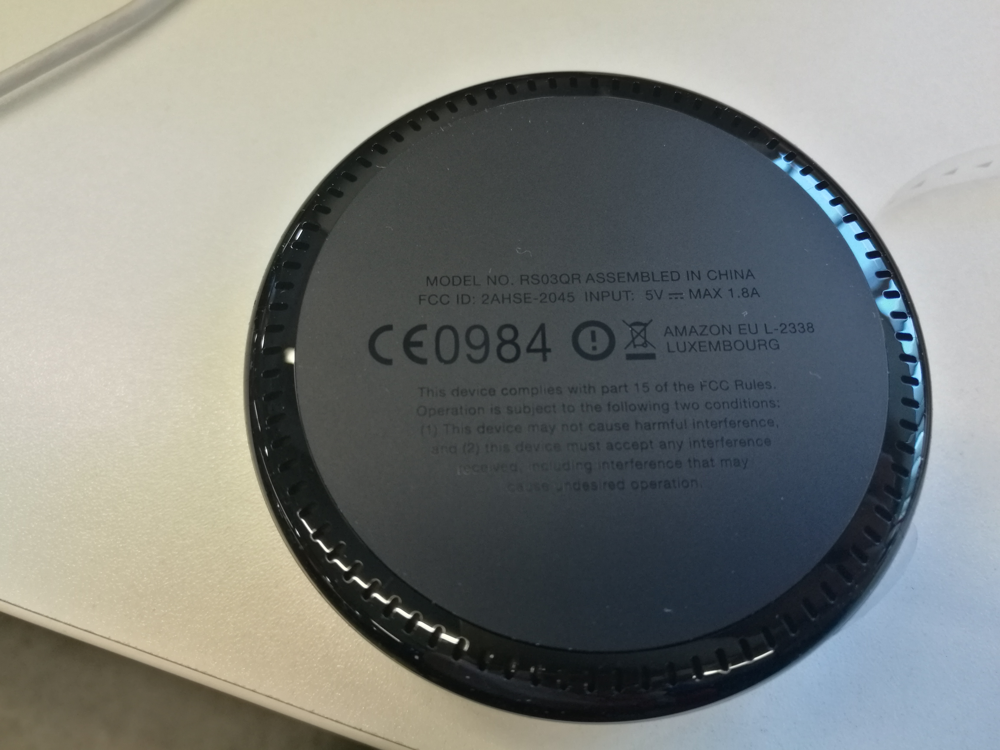
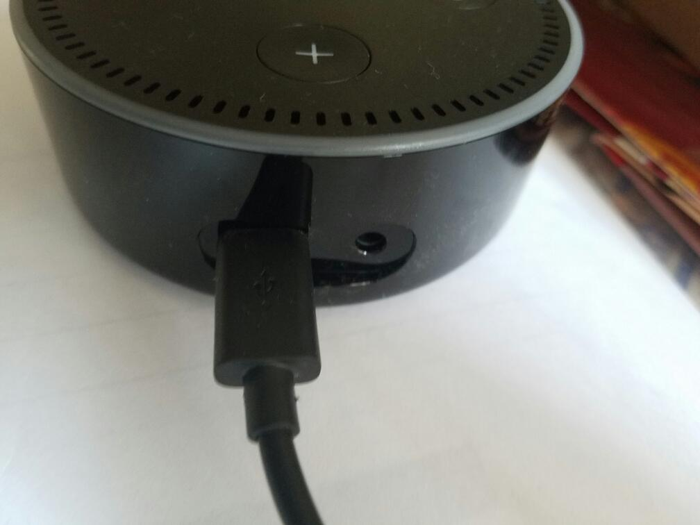

# Amazon echo dot开箱和配置

## 开箱
上个月在亚马逊下单了echo dot，经历了美国东部暴风雪、留下买路钱（交了51.46关税）之后，终于到手。

首先上图：



还是assembly in China，国际通行的标注方式么？～～





包装上的“友情链接”么？


拆开比较方面，撕掉这个塑料条即可。

打开后里面很简洁，只有一个dot、一条线和一个电源适配器。



dot真容：只有上面的四个按钮（其实也没什么用，本来就靠语音嘛～～）


反面有点橡胶感觉，能够防滑，


整体来看，dot真的好迷你，但是拿在手上，会感觉密度挺大，看似很小，份量不轻。

dot接口只有两个，一个是usb的电源接口，一个是3.5mm的音箱接口（毕竟不是echo）。

不过日常使用感觉声音还能接受，没有再连接外置音箱（dot也支持通过蓝牙连接蓝牙音箱，但是看说明建议距离至少3英寸，90多cm。另外dot的包装中也没有3.5mm的线。）

## 配置
配置dot和以前配置智能插座差不多，首先连上电源，开机之后dot会语音提示已经开机。然后需要依赖手机app，才能进行配置。手机app可以在商店里面搜索，也可以去 http://alexa.amazon.com 下载。

配置第一步是选择设备类型，这里选择echo dot，按照要求一步步下去即可。过程中dot会自建一个热点，让手机去连接。有些手机会自动判断wifi是否可用（华为上称作WLAN+），我在设置过程中关闭了该功能，否则会因为手机认为该wifi无效而启动切换到其他已经保存的wifi，导致一直配置不下去。连上dot的热点之后，输入家里的路由器SSID和密码，就可以完成配置了。dot会一直用不同颜色的闪光来表示不同的状态，蓝色就OK了。

dot上线之后，即可响应语音命令了，其他个性化配置可以通过alexa app来设置，第一优先级的是设置时区。在app的```Settings > Devices > Device time zone```中，设置时区为```Asia Chine Standard Time(Shanghai)```，这样问dot：“alexa, what's the time now”，就可以按照北京时间来回复了。因为修改了时区会影响闹钟什么的，所以建议第一个就先修改时区。

配置页面的时区配置上方有个“Device location”，但是这里无法输入美国以外的地址（网上有介绍通过捕捉和修改http请求来强制设置，没有去尝试）。因此基于地理位置的命令都没用，比如问“alexa what's the weather”，dot会告诉你默认的地点——西雅图的天气情况。当然，可以通过在命令中增加地点的方式，来让alexa查询其他城市。但是中国的城市，不知道是不是发音问题，问了“alexa what's the weather in Hangzhou”，只正确识别了一次，其他要不识别成了Hong Kong，要么因为地点没有识别正确，还是返回了西雅图的天气。

## 其他扩展配置（skill）
alexa服务的强大之处，在于可以添加各种skill，扩展其功能。

### todoist
todoist是一个todo list管理工具，这类工具挺多的，但是看alexa app设置，只支持todoist和anydo两个。我使用了todoist（当然，也可以通过ifttt和更多工具进行关联），刚好前段时间手机上装了它的app。

首先是需要关联帐号，从app上可以直接点击link，去进行关联。但是这里会因为Amazon太“聪明”，导致关联问题，所以建议在电脑浏览器上完成关联（包括下面的ifttt帐号关联）。

在浏览器中输入 https://alexa.amazon.com ，登录之后的界面和app上一样，在```Settings > Lists```里面点击todoist的link链接。当其跳转到Amazon登录界面的时候，特别注意如果是中文页面，复制下url，然后将url中的所有zh_CN替换成en_US（sed替换下咯），再次打开页面。这次登录界面会变成英文的，这样才能正确登录美国亚马逊。

关联完成之后，建议去美国亚马逊的“Manage Login with Amazon”中确认下，是否已经有“Todoist for Alexa”。我就是因为Amazon自动识别到了亚马逊中国，结果刚开始关联到了亚马逊中国的帐号，导致alexa无法和todoist进行关联。

确认无误之后，即可尝试alexa的todo管理功能，我还没尝试添加（主要是英语差），只是试了下在todoist app中添加一条待办事项，询问“alexa what's on my todo list”能够识别到我的代办事项，同时alexa app的list中，也能够看见。

### ifttt
ifttt很早就开始用了，之前最常用的是下雨前一天给我发短信通知（但是杭州雨实在太多，经常收到超过10条短信阈值的提醒～～）。这次装好dot之后，第一个就是要关联ifttt帐号，试下传说中的找手机神器（事实上ifttt的语音呼叫服务仅在美国有效，失望了。。。）。

最大的坑就是帐号关联，在ifttt上选择alexa服务，然后关联上Amazon帐号。遇到的问题解决方案前面已经说过了，第一次关联到了中国亚马逊帐号，导致一直提示找不到ifttt的trigger。

关联完成之后，才发现ifttt的语音呼叫仅限于美国的手机号，只能退而求其次，尝试其他ifttt app提供的功能。第一个尝试的是“unsilence my phone”，这是别人已经创建好的applet，直接启动即可（也可以自己调节修改的手机音量，默认是100%，既直接调整成最大音量）。然后对dot说“alexa trigger unsilence my phone”，会触发该规则，将手机音量调整成指定比例。

ifttt还有很多功能可以挖掘，目前尝试的都是和修改手机配置相关的（比如关闭蓝牙、静音等），其他更多的是和智能家居控制相关，这也是后面想尝试的大方向。
