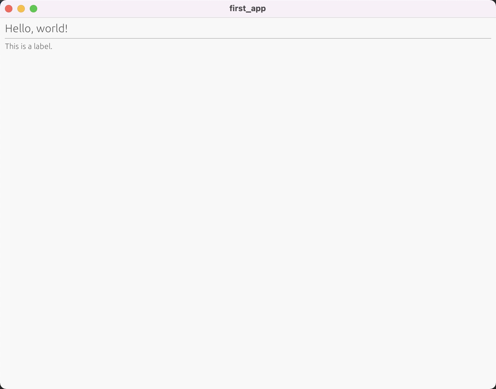

# 尝试下rust下的GUI库——egui

好久没有关注GUI相关的内容了，很早之前用过Qt，然后是QML。当然都是写写demo，连自己用的都算不上。
之前空的时候在学学rust，正好有一次在hack news上看见了[Are we GUI Yet?](https://www.areweguiyet.com/)
这个网站，里面搜罗了很多rust的GUI库，刨掉大部分绑定之后，选择了egui作为入门。

## 第一个rust gui界面
首先先创建一个标准的bin工程，然后添加egui的依赖：

```toml
[package]
name = "guitest"
version = "0.1.0"
edition = "2021"

# See more keys and their definitions at https://doc.rust-lang.org/cargo/reference/manifest.html

[dependencies]
eframe = "0.17.0"
```

这里使用的是eframe，按照官方文档的说明，eframe基于egui的framework，同时支持web和native应用构建。

然后，参照egui的示例，在`main.rs`里面添加一些组件：

```rust
use eframe::{egui, epi};
use crate::epi::egui::Context;
use crate::epi::Frame;

fn main() {
    let app = GuiApp::default();
    eframe::run_native(Box::new(app), eframe::NativeOptions::default());
}

#[derive(Default)]
struct GuiApp {}

impl epi::App for GuiApp {
    fn update(&mut self, ctx: &Context, frame: &Frame) {
        egui::CentralPanel::default().show(ctx, |ui| {
            ui.heading("Hello, world!");
            ui.separator();
            ui.label("This is a label.");
        });
    }

    fn name(&self) -> &str {
        "first_app"
    }
}
```

这里实际上添加了两个Label，一个separator。ui结构体中包含了很多便捷添加内置组件的函数，实际也可以通过手工初始化这些组件进行添加。

运行之后的样式（在mac下）为：



## 一个简单的带状态组件
egui扩展组件的方式是实现`Widget`trait或者实现`|ui: &mut Ui| -> Response { … }`这样类型的函数，都可以快速自定义一个组件。
这里要特别注意，参照`Widget`[文档说明](https://docs.rs/egui/latest/egui/widgets/trait.Widget.html)，通常情况组件只是一个
“生成器（builders）”，因此这些对象本身实际都没有维持状态。

这句话刚开始没有理解，因此写了一个简单的带状态的组件：一个label和一个checkbox的组合，label展示checkbox的当前选中情况。

最初的版本：
```rust
use eframe::{
    egui::Widget,
    egui::Response,
    egui::Ui,
    egui::WidgetText
};

pub struct CheckBoxWithLabel {
    checked: bool,
    text: WidgetText
}

impl CheckBoxWithLabel {
    pub fn new(checked: bool, text: impl Into<WidgetText>) -> Self {
        CheckBoxWithLabel {
            checked,
            text: text.into()
        }
    }
}

impl Widget for CheckBoxWithLabel {
    fn ui(mut self, ui: &mut Ui) -> Response {
        ui.horizontal(|ui| {
            ui.label(format!("current checkbox state: {}", checked));
            ui.checkbox(&mut self.checked, self.text);
        }).response
    }
}
```
然后在`main.rs`的update函数中增加这个组件：
```
let check_box_with_label = widget::CheckBoxWithLabel::new(false, "a checkbot");
ui.add(check_box_with_label);
```

这时候界面上会新增一行，左边是一个label，右边是一个checkbox。
但是，不论怎么点都没有效果，左边label里面显示的state永远不会是true，右边checkbox也永远不会变成选中状态。

查了半天，因为每次界面需要更新的时候，实际都是新创建了一个组件对象，因此即使当时组件对象的字段修改了，下次界面刷新之后还是初始状态。
最终参照egui_demo_lib里面的一些组件实现，egui通过context提供了一个状态存储。如果组件需要保持状态，可以使用这个状态存储功能来保存。

```rust
fn ui(self, ui: &mut Ui) -> Response {
    let state_id = ui.id().with("checkbox_state");
    let mut checked = ui.data().get_temp::<bool>(state_id).unwrap_or(self.checked);
    ui.horizontal(|ui| {
        ui.label(format!("current checkbox state: {}", checked));
        ui.checkbox(&mut checked, self.text);
        ui.data().insert_temp(state_id, checked);
    }).response
}
```
最终修改组件实现的`Widget` trait函数，将checkbox修改后的状态进行保存，这样就可以进行联动了。

