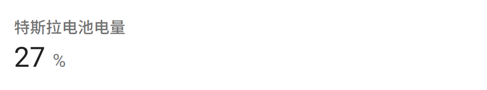

# 将特斯拉车辆数据接入homeassistant

最近闲来无事继续尝试之前clone过来的一个[工程](https://github.com/babydragon/tesla-rs)：基于rust的tesla api。
除了将授权步骤重新调通之外，还增加了mqtt的sink模块，这样就可以和homeassistant进行交互了。

具体的实现细节，都在代码里面了，同时也刚把构建方式写了下，可以根据这个构建方式很方便的构建出香蕉派、树莓派等基于ARM架构的可执行程序。

下面主要说下如何配置HA。

首先需要一个mqtt broker,这个之前已经在我的香蕉派上安装了mosquitto,同时做好了简单的配置。然后是确认HA的集成信息里面已经有了mqtt。
这些前置工作都做完之后，需要配置一个基于mqtt的sensor（当然基于mqtt的sensor也可以做成自动注册的，HA有对应的文档，这里只是为了验证）。

打开HA的配置文件（我是用python安装的，在$HOME/.homeassistant/configuration.yaml），加入以下配置：

```yaml
sensor:
  - platform: mqtt
    name: "Tesla battary level"
    state_topic: "vehicle/tesla"
    unit_of_measurement: "%"
    value_template: "{{value_json.charge_state.battery_level}}"
```

说明下配置：
* `name`: 这里的name就是传感器的名字，虽然是可选的，但是不要忽略，不然后面配置界面的时候不好配置。
* `state_topic`：读取状态的mqtt topic,这里设置的和teslac的配置文件相同即可，teslac会定时通过API读取车辆信息，然后发送到配置的topic上。
* `unit_of_measurement`：传感器数据的单位，这里实验的是读取电池剩余电量，所以单位是%
* `value_template`：从`state_topic`中读取到的值，提取模板。这里读取的是电池状态中的`battery_level`。

如果要配置其他数据，可以使用`teslac get_all_data`命令来查看输出，然后在`value_template`中解析对应的字段即可。

配置完成后，重启下HA，确保新的配置生效。然后就可以通过`teslac daemon`来开启定时读取车辆数据。

**注意：**`teslac`的具体配置方式可以参照github的readme,建议先完成授权流程，然后再添加mqtt相关配置。

最后是HA界面配置，可以在首页新增一个实体卡片，其中：
* 实体：选择刚刚配置的实体，既`sensor.tesla_battary_level`
* 名称：可选，不设置就是实体的名字，可以设置一个比如“特斯拉电池电量”
* 图标：HA的图标可以去[materialdesignicons](https://materialdesignicons.com/)上选择一个图标，这里我选择了汽车电池，既`mid:car-battery`。（这个感觉也不太像，毕竟这个在车子仪表盘里面是用来表示小电池的。。。）
其他都没有选，完成后可以在HA仪表盘上看见这个实体卡片：


