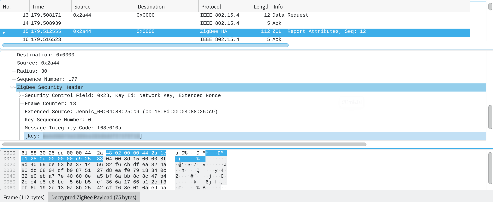

# 硬件小白ZigBee初探

很早之前就买了几篇亿百特的ZigBee芯片（还是邮票孔的，还不知道怎么焊接。。。），其中有一个USB的支持抓包，刚好过年有空来尝试一下。

由于商家文档给的抓包工具是基于Windows的TI官方提供的抓包工具，没法直接用，为了能够使用，经历了一番折腾。

## 基础软件安装
之前一直以为这东西也是通过串口通信的，天真的以为通过串口工具就可以直接开始使用，甚至尝试作为一个ZigBee的节点。结果插上电脑之后，通过`dmesg`可以看见内核正常识别到了USB设备：
```
[15597.203265] usb 1-6: new full-speed USB device number 11 using xhci_hcd
[15597.334945] usb 1-6: New USB device found, idVendor=0451, idProduct=16ae, bcdDevice= 3.71
[15597.334950] usb 1-6: New USB device strings: Mfr=1, Product=2, SerialNumber=0
[15597.334952] usb 1-6: Product: CC2531 USB Dongle
[15597.334953] usb 1-6: Manufacturer: Texas Instruments
```
但是，查看dev目录下，却没有新增任何串口设备。之前玩过ESP8266什么的，都是插上之后就能创建出类似`/dev/ttyUSB0`之类的串口设备，这次什么都没有。

刚开始以为是缺少驱动，搜了一圈发现这个设备里面内置的固件是用来抓包的，不是一个串口设备。搜了半天，找到了[whsniff](https://github.com/homewsn/whsniff)这个工程。
从简介上看，这个工具是能够和USB设备通信，将数据包转成wireshark能够识别的pcap格式。这样，我们就可以在wireshark中查看抓到的ZigBee数据包了。

安装方式比较简单，标准的`make`和`make install`，之后就可以得到一个可执行程序：`whsniff`。

## 开始抓包
前面安装好的`whsniff`需要制定监听的信道，先随便来一个：

```
whsniff -c 11
```
这样就能在信道11开始监听和抓包了，刚开始只是尝试是否能够抓到包，所以还没将输出重定向给wireshark。

遗憾的是，监听在信道11,并没有一个ZigBee的数据包。忘了说了，手头唯一有的ZigBee设备是Aqara水浸传感器，搭配小米多模网关。尝试了长按传感器，使其进入搜网模式，终于在信道11抓到了入网搜索的广播包。
这也说明了ZigBee设备在搜网的时候会向全信道发送广播包。

由于不知道小米网关使用的信道，刚开始网上也没找到（后来搜到了。。。），只能写一个脚步尝试各个信道：

```bash
for c in `seq 11 26`; do echo "sniff on channel $c" && timeout 1m whsniff -c $c; done
```
这个脚本从11信道开始，在每个信道监听1分钟，可以通过是否有数据来判断小米网关工作的信道。不过由于每个信道要等1分钟，还是挺麻烦的。

最后还好没有等到信道26,在20的时候发现有挺多数据包的，基本确认小米网关工作在信道20。

之后才是正式开始抓包：
```bash
whsniff -c 20 | wireshare -c -i -
```

这时就能够在wireshark界面上实时看见ZigBee数据包，这时都是协调器（小米网关）发出的广播包。

### 解密
ZigBee的数据内容是经过加密的，可以在wireshark中配置密钥和加密方式，这样就可以让wireshark解密，直观的看见传输的具体内容。密钥有两部分，一个是所谓的“Trust Center link key”，一个是所谓的“network key”。

前者是一个固定值，后者是协调器发起网络的时候配置的。先添加第一个，在wireshark的“编辑”->“首选项”中，找到“Propocols”，选择ZigBee。在“Pre-configured Keys”中添加：
Key为`5A:69:67:42:65:65:41:6C:6C:69:61:6E:63:65:30:39`，“Byte order”选择Normal。

后者由于不知道小米的network key,需要将设备重新入网，入网过程中可以抓到。

对于水浸传感器，可以长按几秒钟，蓝灯闪烁的时候放开。这时候网关会“滴”一声，这时候设备会退出网络，同时米家app中也会删除这个设备。
这时候，在米家app中重新发起添加设备，然后长按传感器，等蓝灯闪烁的时候放开，网关发出“滴”的声音，设备入网成功。

完成添加设备之后，可以回到wireshark界面，找到发送源头不是网关的数据包，其中“ZigBee Security Header”中可以找到对应的key。


得到了network key之后，再去wireshark中添加，后续的ZigBee负载就可以直接解码了。
